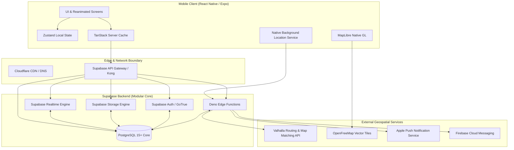
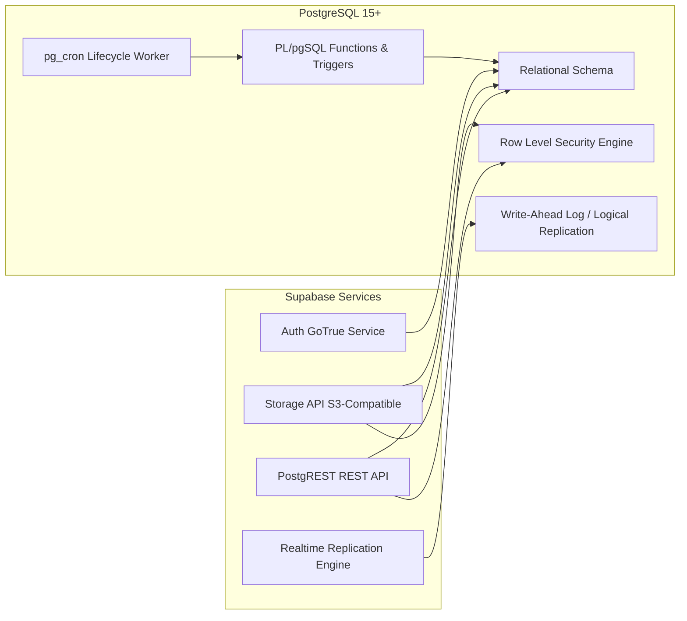
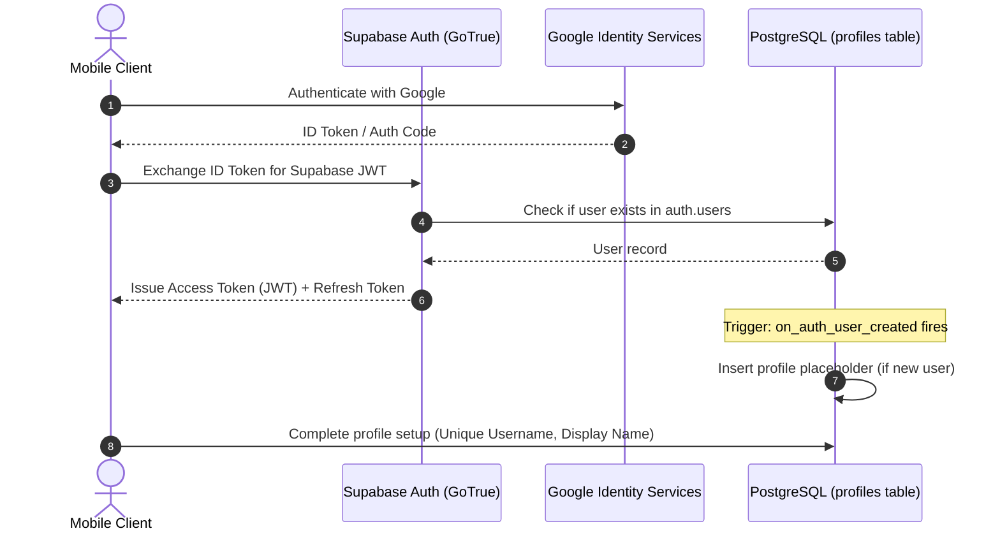
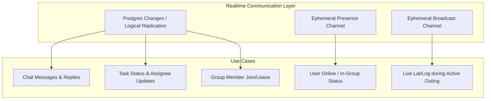
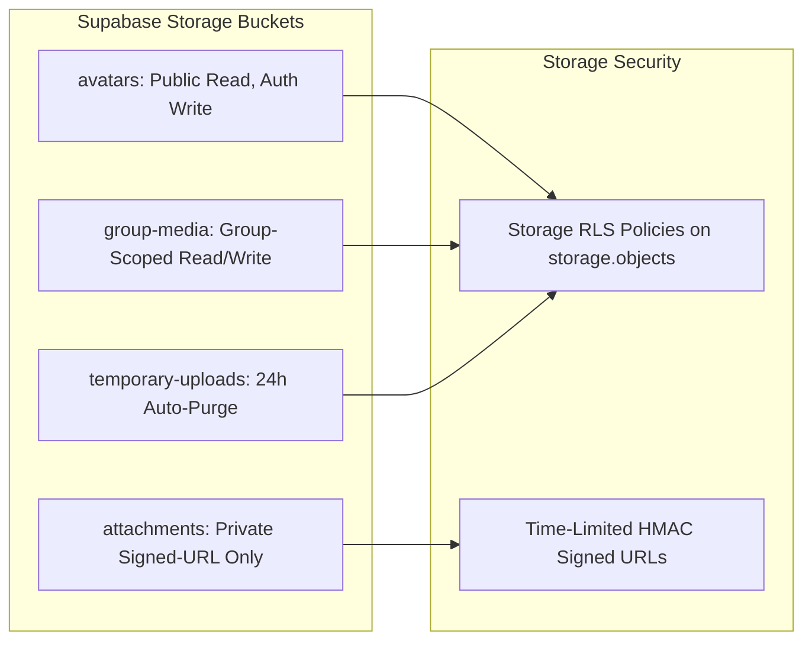
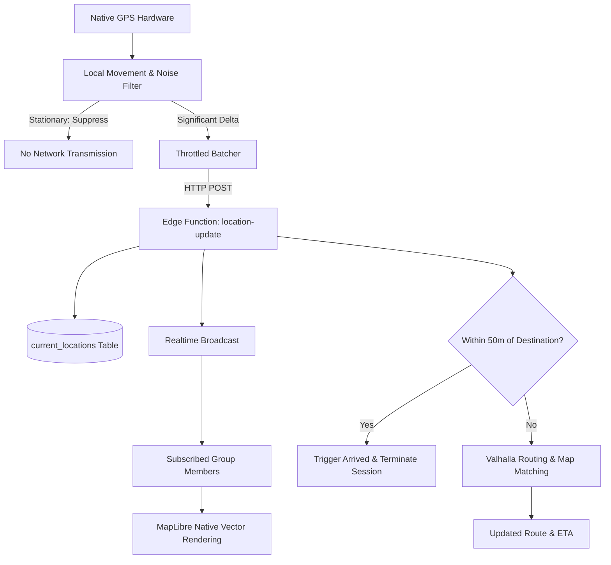
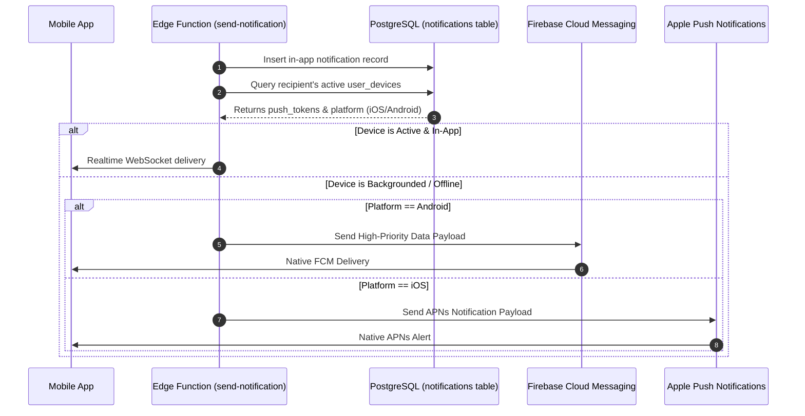
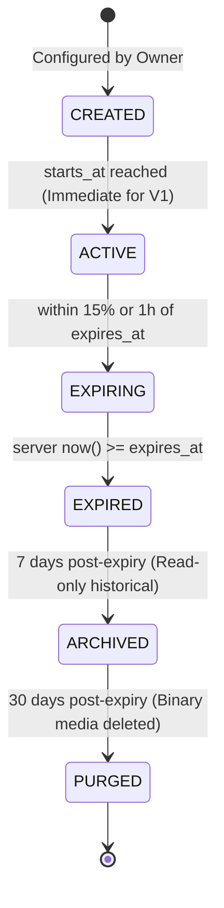

# Purpose-Driven Temporary Social Platform: Master System Architecture

## 1. System Overview & Monolithic Philosophy

The system is architected as a **Modular Monolith** designed for high security, low operational overhead, aggressive battery efficiency, and instantaneous collaboration.

Rather than fragmenting into distributed microservices with Kafka, Redis, or Kubernetes, all transactional, relational, authorization, and realtime responsibilities reside in a unified **PostgreSQL + Supabase** core, paired with a modern **React Native (Expo Dev Client)** mobile client.



---

## 2. Client vs. Server Boundary (Strict Mandate)

A fundamental architectural failure in modern social applications is trusting client-side logic for security, state transitions, or temporal expiration. In this platform:

| Capability / Concern | Handled on Client (Mobile) | Handled on Server (Supabase / PG) |
| :--- | :--- | :--- |
| **Authentication** | Token capture, biometrics, secure storage in Keychain/Keystore | Token issuance, signature verification, OAuth callback, user identity revocation |
| **Authorization & RLS** | Cosmetic conditional rendering (showing/hiding buttons) | Row Level Security (RLS) enforcement on 100% of queries, mutations, and channels |
| **Friendship Rule** | Disabling non-friend select in UI invite picker | Database-level and Edge-Function-level blocking of non-friend additions |
| **Group Lifecycle** | Visual countdown timers, local animations, cached view | Canonical `starts_at`, `expires_at`, lifecycle state machine, write rejection |
| **Device Clock** | Visual rendering only | Never trusted; server `now()` governs all temporal evaluations |
| **GPS Sampling** | Local sensor polling, movement delta calculation, battery throttle | Ingestion validation, ephemeral storage, active-session verification |
| **Realtime Location** | Animated coordinate interpolation on map | Ephemeral broadcast to authorized active group subscribers only |
| **File Storage** | Client-side image compression, progress display | Bucket access policies, mime-type validation, signed download URL generation |
| **Push Notifications** | Device token registration, notification display handling | Event triggers, FCM/APNs payload generation, dispatch and deduplication |

---

## 3. React Native Mobile Application Architecture

The mobile client is built on React Native using TypeScript with strict type-checking and native platform bindings through Expo Prebuild.

```
src/
├── app/                  # App initialization, providers, root navigation
├── design/               # Design tokens (colors, typography, radii, spacing, motion)
├── components/           # Generic atomic and molecular UI components (buttons, cards, inputs)
├── features/             # Domain-driven feature slices:
│   ├── auth/             # Login, Google OAuth, session refresh
│   ├── profile/          # User profile view, edit, exact search
│   ├── friends/          # Friend requests, friendships list, blocking
│   ├── groups/           # Group creation, circular dial, overview, settings
│   ├── chat/             # Realtime messaging, thread replies, attachments
│   ├── tasks/            # Task board, status transitions, assignees
│   ├── files/            # File gallery, upload manager, document viewer
│   ├── events/           # Event schedules, countdowns, destinations
│   ├── polls/            # Poll creator, voting engine, live results
│   ├── location/         # Native location service, movement filter, outing board
│   ├── maps/             # MapLibre container, custom vector layers, route rendering
│   └── notifications/    # In-app notification center, badge counters
├── lib/                  # Infrastructure adapters (Supabase client, Valhalla client, Sentry)
├── state/                # Global UI state (Zustand)
└── types/                # Shared TypeScript contracts and database models
```

### State Management Strategy
1. **Server State (TanStack Query v5)**:
   - Primary data cache for profiles, groups, tasks, files, and events.
   - Cache invalidation triggered automatically by Supabase Realtime Postgres change events.
   - Optimistic mutations for instant UI feedback (e.g. task toggles, chat message appending).
2. **Local Client State (Zustand)**:
   - Ephemeral UI state: Active duration dial angle/values, modal visibility, active tab, map camera position, and audio/haptic preferences.
3. **Form Management (React Hook Form + Zod)**:
   - Zero unvalidated form inputs. All user input is sanitized and validated against shared Zod schemas before network transmission.

---

## 4. Supabase & PostgreSQL Core Architecture

Supabase acts as the consolidated platform engine, leveraging native PostgreSQL capabilities:



### PostgreSQL Engine Features:
- **Logical Replication & WAL**: Drives Supabase Realtime by streaming database mutations directly to subscribed WebSocket clients.
- **Row Level Security (RLS)**: Enforces table-level access rules directly in SQL using `auth.uid()`, preventing any bypassing of API layers.
- **`pg_cron`**: Runs scheduled database jobs inside PostgreSQL (e.g., lifecycle expiration checks every minute).
- **PostGIS / Geospatial**: Stores geographic coordinates for events and destinations (`geography(Point, 4326)`).

---

## 5. Authentication & Identity Architecture

Authentication utilizes Supabase Auth (GoTrue) with Google OAuth 2.0 and native token storage.



### Security Details:
- Tokens are stored in the device's hardware-backed keystore via `expo-secure-store`.
- Access tokens expire every 60 minutes; refreshed automatically via background rotation.
- Profile creation is coupled with an unchangeable UUID PK linked directly to `auth.users(id)`.

---

## 6. Realtime Architecture

Realtime is segregated into two operational layers: **Persistent Relational Sync** and **Ephemeral Broadcast**.



### Distinction: Presence vs. Location
- **Presence is NOT Location**: Presence tracks whether a user is connected, typing, or viewing a screen. It has zero access to coordinates.
- **Location is Ephemeral Broadcast**: Transmitted via scoped Realtime channels only during an active outing session. Coordinates are not preserved in chat logs or permanent history.

---

## 7. Storage Architecture

Files are hosted on Supabase Storage (backed by S3) and segmented into four dedicated buckets:



- **`avatars`**: Publicly readable; users can only write to their own path (`{user_id}/*`).
- **`group-media`**: Group icons and cover images; accessible only by active group members.
- **`attachments`**: Chat files, project PDFs, and docs; strictly private. Download requires a 15-minute time-limited HMAC signed URL generated via Edge Function.
- **`temporary-uploads`**: Staging area for multi-part processing, purged automatically after 24 hours.

---

## 8. Edge Functions & Background Workers

Edge Functions run on Deno at the edge and handle operations requiring elevated service-role privileges or external integrations.

```
supabase/functions/
├── create-group/         # Validates mutual friendship, checks duration, atomic creation
├── invite-member/        # Server-enforces mutual friendship before adding to group
├── send-notification/    # Coordinates FCM/APNs push dispatches
├── location-update/      # Ingests throttled GPS, updates current_location, evaluates geofence
├── route-request/        # Proxies Valhalla routing and ETA requests
├── lifecycle-worker/     # Cron job transitioning expired groups and terminating sessions
├── purge-worker/         # Retention engine purging expired media and soft-deleted rows
└── username-search/      # Exact username search with anti-enumeration rate limiting
```

---

## 9. Map & Location Architecture

The mapping stack couples open-source geospatial tools with on-device intelligence:



### Geospatial Components:
- **MapLibre Native**: High-performance OpenGL/Metal vector rendering on iOS and Android.
- **OpenFreeMap**: Open-source vector tiles styled with clean, muted, distraction-free palettes.
- **Valhalla**: Open-source routing engine providing road map-matching, multipoint routing, and real-time ETAs without commercial API lock-in.

---

## 10. Notification Architecture

The notification engine ensures reliable alerting without notification spam.



---

## 11. Group Lifecycle Architecture

The group is a temporal container. Its lifecycle transitions are strictly server-managed:



### Lifecycle Operational Rules:
1. When `lifecycle_state == 'EXPIRED'`:
   - All `INSERT`, `UPDATE`, and `DELETE` queries on `messages`, `tasks`, `events`, and `files` are immediately rejected by RLS.
   - Any ongoing `location_sessions` are automatically closed.
   - Background push notifications for the group are halted.
2. In `ARCHIVED`:
   - Group members can view historical text and task records in read-only mode.
3. In `PURGED`:
   - Storage attachments and avatar blobs are permanently removed from S3. Database records are either hard-deleted or scrubbed according to retention policy.
