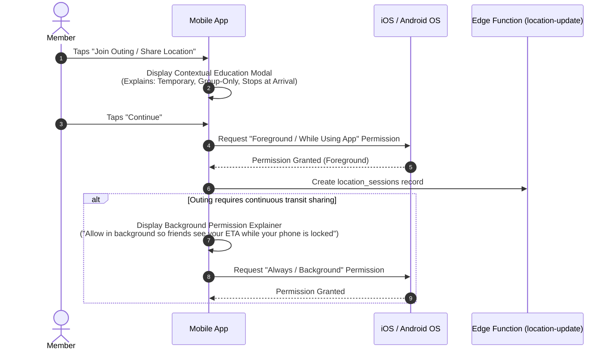
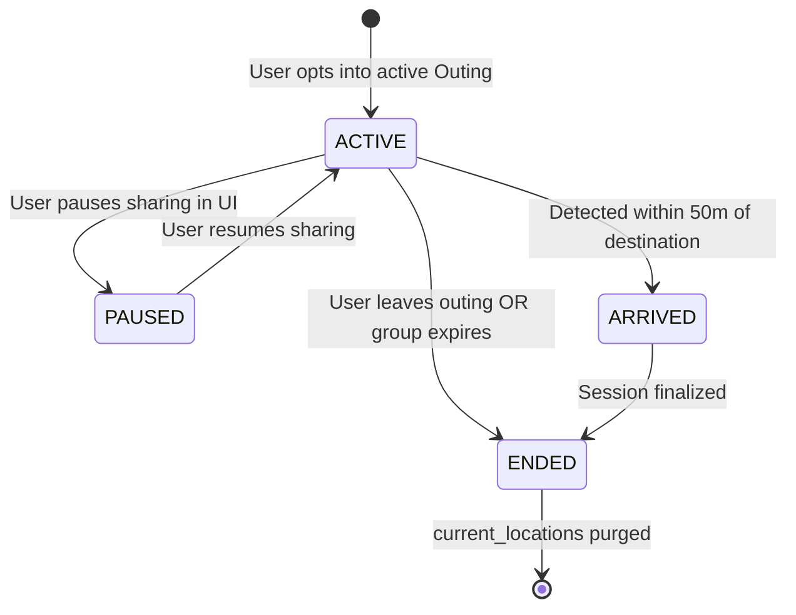
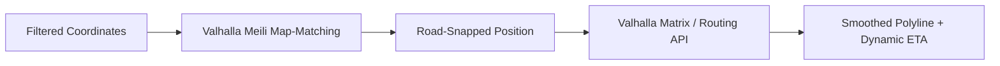
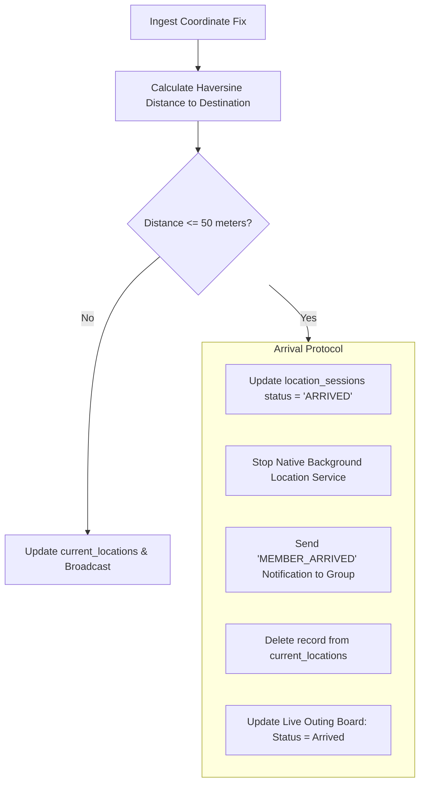

# Purpose-Driven Temporary Social Platform: Master Location & Map Engine Plan

## 1. Executive Summary & Geospatial Philosophy

Physical coordination is a core capability of this platform, but **location is treated as temporary, sensitive telemetry, NOT an ongoing surveillance product**.

### Core Location Laws:
1. **Opt-in Only**: Tracking is initiated solely by explicit user consent inside an active outing.
2. **Group-Scoped & Ephemeral**: Coordinates are accessible only to fellow active group members during that specific session.
3. **Zero Historical Breadcrumbs**: Raw GPS trails are never archived. Only the latest position is maintained in `current_locations`.
4. **Aggressive Battery Preservation**: Sampling and network transmission are separate pipelines. Movement detection suppresses stationary transmissions entirely.
5. **Auto-Termination**: Arrival within $50\text{m}$ of the destination immediately shuts down location sensors.

---

## 2. Permission Strategy & User Education Flow

Mobile operating systems heavily restrict background location access. Requesting background permissions prematurely causes immediate user denial.



---

## 3. Location Session Lifecycle & Architecture

A location session is an explicit time-bound contract stored in `location_sessions`:
- `starts_at`: Session start timestamp.
- `ends_at`: Hard cutoff timestamp (cannot exceed group `expires_at`).
- `destination_lat`, `destination_lng`: Target coordinates.
- `status`: `ACTIVE`, `PAUSED`, `ARRIVED`, `ENDED`.



---

## 4. On-Device GPS Collection & Movement Detection Engine

The client must **never** pipe raw hardware GPS updates directly to the backend. An on-device filtering pipeline processes raw fixes:

```
[Hardware GPS Fix (1Hz)]
         │
         ▼
[Accuracy Filter: Discard if accuracy > 35m]
         │
         ▼
[Haversine Delta Calculation against Last Transmitted Coordinate]
         │
         ├── If stationary (delta < 15m & speed < 0.5 m/s):
         │       └── DROP FIX (0 network transmissions)
         │
         ├── If walking (speed: 0.5 - 3 m/s & delta >= 15m):
         │       └── Queue update (Min transmission interval: 30s)
         │
         └── If driving (speed > 3 m/s & delta >= 50m):
                 └── Queue update (Min transmission interval: 10s)
```

### Adaptive Cadence Rules
| Movement Mode | Speed Window | Distance Threshold | Transmit Cadence | Battery Profile |
| :--- | :--- | :--- | :--- | :--- |
| **Stationary** | $< 0.5\text{ m/s}$ | $< 15\text{ m}$ | **Zero transmissions** | Near-zero CPU / radio wake |
| **Walking** | $0.5 - 3.0\text{ m/s}$ | $\ge 15\text{ m}$ | Every $30\text{ s}$ | Low power (~1% battery/hr) |
| **Driving** | $> 3.0\text{ m/s}$ | $\ge 50\text{ m}$ | Every $10\text{ s}$ | Moderate (~3–5% battery/hr) |
| **Near Target**| Dist $< 250\text{ m}$ | $\ge 10\text{ m}$ | Every $5\text{ s}$ (Burst) | High relevance for meetup |

---

## 5. Network Throttling & Ingestion Pipeline

To prevent battery depletion from mobile radio wake-ups:
1. **Debounce Buffer**: A minimum cooldown timer is enforced before firing an HTTP POST to `location-update`.
2. **Payload Minimization**:
   ```json
   {
     "session_id": "8f3b1b6e-...",
     "lat": 13.0827,
     "lng": 80.2707,
     "acc": 8.5,
     "speed": 11.2,
     "bearing": 184.0,
     "timestamp": 1774261892000
   }
   ```
3. **Server Ingestion**: The Edge Function executes:
   - Verifies JWT and checks that session status is `ACTIVE`.
   - Checks distance to destination.
   - Upserts latest coordinates into `current_locations` (overwriting the previous fix).
   - Broadcasts the update to the group's Realtime channel.

---

## 6. Valhalla Routing, Map Matching & ETA

Raw GPS traces jump across buildings and off-road paths. We leverage **Valhalla** (open-source routing engine) for snapping and route estimation.



### Valhalla Optimization Rules:
1. **Do Not Call Routing on Every GPS Update**: Recalculate routes only when:
   - Initial outing launch.
   - User deviates $>100\text{m}$ from previous route geometry (re-routing).
   - Once every $60\text{s}$ while moving to refresh ETA based on traffic profiles.
2. **Client-Side ETA Extrapolation**: Between Valhalla requests, the mobile client linearly decrements ETA using current vehicle speed, preventing jittery network polling.

---

## 7. MapLibre Native & OpenFreeMap Vector Integration

### Vector Map Stack:
- **Renderer**: `@maplibre/maplibre-react-native` (native C++ rendering on Metal/OpenGL).
- **Tile Provider**: OpenFreeMap vector tile endpoint (`https://tiles.openfreemap.org/styles/bright`).
- **Attribution**: "© OpenStreetMap contributors, OpenFreeMap".

### Visual Hierarchy & Layering on Outing Screen:
1. **Base Tile Layer**: Muted vector map styling with minimal distraction.
2. **Route Polyline Layer**: Solid Indigo-Violet (`Tokens.colors.primary.default`) with 4pt width and rounded caps.
3. **Destination Marker Layer**: High-contrast Teal icon with pulsing radial geofence indicator ($50\text{m}$).
4. **Member Marker Layer**:
   - Custom SVG marker rendering member avatar inside a circular frame.
   - Vehicle / Walking indicator badge.
   - Smooth coordinate interpolation using Reanimated: markers glide between fixes over $1.5\text{s}$ rather than teleporting.

---

## 8. Arrival Detection & Tracking Termination



---

## 9. Platform-Specific Native Considerations

### 9.1 Android Implementation
- **Foreground Service**: Android 8.0+ strictly throttles background location unless bound to a running Foreground Service.
- **Persistent Notification**: Required by Android OS when active. Content: *"Sharing location with Chennai Outing (Tap to stop)"*.
- **Location Request Settings**:
  - `Priority`: `PRIORITY_BALANCED_POWER_ACCURACY` during walking; `PRIORITY_HIGH_ACCURACY` only during driving.
  - `smallestDisplacement`: $15\text{m}$.
- **Doze Mode Handling**: Whitelist battery optimization only if user explicitly selects background transit tracking.

### 9.2 iOS Implementation
- **CoreLocation**: `CLLocationManager` configured with:
  - `allowsBackgroundLocationUpdates = true`
  - `pausesLocationUpdatesAutomatically = true` (enables OS to sleep GPS when car stops in traffic).
  - `activityType = .automotiveNavigation` or `.fitness`.
  - `desiredAccuracy = kCLLocationAccuracyNearestTenMeters`.
- **Blue Status Bar / Capsule Indicator**: iOS displays the blue location capsule indicator in the status bar while the background service is active, ensuring 100% transparency.

---

## 10. Failure Cases & Graceful Degradation

| Failure Scenario | System Behavior & Fallback | User Communication |
| :--- | :--- | :--- |
| **User Revokes Location Permission Mid-Session** | Native service catches authorization change; emits session pause to backend. | Banner on Outing screen: *"Location permission turned off. Sharing paused."* |
| **GPS Signal Lost (Tunnel / Subway)** | Accuracy filter rejects fixes $>35\text{m}$. Freezes last known position; timer marks status as "Signal lost". | Marker displays grayed-out badge: *"Signal lost 2m ago"*. |
| **Valhalla Service Outage** | Routing polyline fails to load. System falls back to a straight geodesic dashed line to destination and calculates straight-line ETA. | No crash. Outing board continues displaying distance and coordinates. |
| **Map Tile Server Rate-Limited** | MapLibre uses on-device disk tile cache. If empty, falls back to minimal cached vector geometry. | Live board (textual ETA, distance, and arrivals) remains 100% operational. |
| **Device Clock Tampered** | Backend checks `now()`. If server time exceeds `ends_at`, backend rejects update with HTTP 410 Gone. | Mobile client halts tracking and prompts user to synchronize device clock. |
