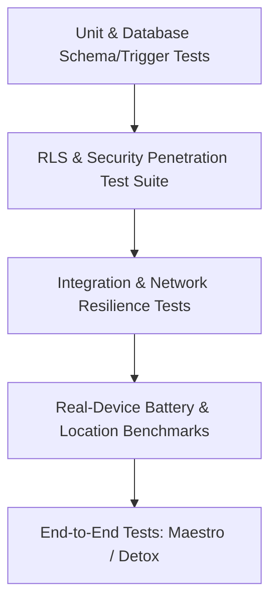

# Purpose-Driven Temporary Social Platform: Master Verification & Test Plan

## 1. Quality Assurance Philosophy

Software in this domain deals with **real-time synchronization, physical coordinates, strict temporal expiration, and battery consumption**. 

A feature is never "done" simply because the happy path renders on a simulator. The system must be verified across 15 distinct testing dimensions before production deployment.

---

## 2. Test Pyramid & Methodology Matrix



---

## 3. Detailed Test Suites

### 3.1 Unit Tests (Jest)
* **Scope**: Pure functions, mathematical algorithms, utilities, and schema validators.
* **Key Targets**:
  - **Duration Dial Calculation**: Test conversion of months, days, hours into millisecond intervals and PostgreSQL intervals. Test edge cases: 0 months, 0 days, 1 hour; leap years; month length variations (28, 30, 31 days).
  - **Username Normalizer**: Test regex validation (`^[a-z0-9_]{3,20}$`). Verify trimming, lowercase conversion, and rejection of special characters/emojis.
  - **Haversine Distance**: Test distance calculations against known geodesic coordinates (e.g. Chennai Central to Anna Nagar Tower Park).
  - **Zod Form Schemas**: Validate create group schema, profile update schema, task creation schema, and event creation schema.

---

### 3.2 Database & Trigger Tests (pgTAP)
* **Scope**: Execute SQL unit tests directly inside PostgreSQL using `pgTAP`.
* **Key Scenarios**:
  - `test_auto_profile_creation`: Inserting an `auth.users` row generates a corresponding `profiles` row with username fallback.
  - `test_friendship_symmetry`: Inserting `(user_high, user_low)` triggers the normalizer to flip the order to `user_low < user_high`.
  - `test_friend_only_trigger`: Direct `INSERT` into `group_members` where no friendship exists between user and group owner raises a SQL exception and fails.
  - `test_group_expiration_constraint`: `INSERT` into `groups` with `expires_at <= starts_at` violates check constraint.

---

### 3.3 Row Level Security (RLS) Tests
* **Scope**: Programmatic test suite using `@supabase/supabase-js` simulating various JWT roles and identities.
* **Positive Scenarios (Must Succeed)**:
  - User A (Member) queries messages from Group X $\to$ Receives rows.
  - User A inserts a message into active Group X $\to$ Succeeds.
  - User A (Owner) updates group settings $\to$ Succeeds.
* **Negative Scenarios (Must Fail / Deny)**:
  - User B (Non-Member) queries messages from Group X $\to$ Returns empty array (0 rows).
  - User B attempts `INSERT` into Group X messages $\to$ Fails with 403 / RLS policy violation.
  - User C (Admin) attempts to demote or remove the Owner $\to$ Blocked by RLS.
  - User A attempts `INSERT` into messages for Group X after `lifecycle_state = 'EXPIRED'` $\to$ Blocked by RLS.
  - User D attempts to select `current_locations` for a session belonging to a group they are not in $\to$ Returns 0 rows.

---

### 3.4 Authentication & Identity Tests
* Google OAuth sign-in flow completes and updates secure store tokens.
* Token expiry handling: Expired access token refreshes automatically without user disruption.
* Revocation test: Deleting or banning an `auth.users` record immediately invalidates sessions and halts queries.
* Device token registration: Logging in registers APNs/FCM token to `user_devices`; logging out deregisters the token.

---

### 3.5 Group Lifecycle & Expiry Automation Tests
* **Lifecycle State Transition Verification**:
  1. Create group with 1-minute expiration: `starts_at = now()`, `expires_at = now() + INTERVAL '1 min'`.
  2. Lifecycle worker executes at $T+61\text{s}$.
  3. Verify group status transitions to `EXPIRED`.
  4. Verify all associated `location_sessions` are set to `ENDED`.
  5. Verify `current_locations` records are purged.
  6. Attempt message insertion $\to$ Verify rejection.
* **Client Clock Spoofing Resilience**: Set physical device clock 3 days into the past. Group must still be evaluated as `EXPIRED` because server PostgreSQL `now()` governs access.

---

### 3.6 Location Engine & Battery Consumption Tests
* **Battery Endurance Benchmarks (Physical Devices - iPhone 14 & Pixel 7)**:
  - **Stationary Test (30 mins)**: Phone stationary on desk. GPS sampling running.
    * *Threshold*: 0 network transmissions emitted; battery drain $< 0.5\%$.
  - **Walking Test (30 mins)**: Continuous walking transit ($1.2\text{ m/s}$).
    * *Threshold*: Updates emitted every 30s or 15m; battery drain $< 1.5\%$.
  - **Driving Test (60 mins)**: Highway / city driving with navigation.
    * *Threshold*: Updates emitted every 10s or 50m; Valhalla route recalculation triggered only on significant deviations; battery drain $< 4.5\%$.
* **Arrival Geofence Test**:
  - Simulate movement approaching destination coordinate.
  - At distance $\le 50\text{m}$, location session status transitions to `ARRIVED`.
  - Native background location service stops immediately; zero further GPS pings.

---

### 3.7 Realtime & Network Resilience Tests
* **Realtime Delivery Speed**: Two active clients in the same group; message sent from Client 1 must render on Client 2 in $<200\text{ms}$ over 4G/Wi-Fi.
* **Network Partition & Reconnection**:
  1. Client sends message while active.
  2. Trigger Airplane Mode on Client for 60 seconds.
  3. Other members send 5 messages.
  4. Disable Airplane Mode.
  5. Supabase Realtime channel must reconnect automatically, pull missed messages, and resume live streaming.
* **Poor Connection (3G Throttling & 20% Packet Loss)**:
  - Verify optimistic chat UI renders pending state, retries with exponential backoff, and resolves without message duplication.

---

### 3.8 End-to-End (E2E) User Journeys (Maestro)

```yaml
# Maestro E2E: Outing Flow
appId: com.purposesocial.app
---
- launchApp
# 1. Sign In
- tapOn: "Continue with Google"
# 2. Search exact friend
- tapOn: "Friends"
- tapOn: "Search"
- inputText: "karthik"
- tapOn: "Add Friend"
# 3. Create Outing Group
- tapOn: "Create"
- inputText: "Marina Beach Meetup"
- tapOn: "Outing"
# 4. Configure Duration Dial
- scrollUntilVisible:
    element: "Duration Dial"
    direction: DOWN
- tapOn: "Next"
# 5. Add Friend
- tapOn: "Karthik"
- tapOn: "Create Group"
# 6. Outing Location Sharing
- tapOn: "Share Location"
- tapOn: "Allow While Using App"
- assertVisible: "Marina Beach Meetup"
- assertVisible: "Live Outing Board"
```

---

## 4. Acceptance Criteria & Definition of Done Matrix

| Milestone Area | Specific Acceptance Criteria | Pass / Fail |
| :--- | :--- | :---: |
| **Security & RLS** | 100% of tables enforce RLS. All unauthorized read/write tests return 403 or empty sets. | [ ] |
| **Friendship Rule** | A user cannot be added to a group unless an accepted two-way friendship exists with the inviter. | [ ] |
| **Lifecycle** | Expired groups reject all new messages, tasks, and media. State transitions are governed solely by server time. | [ ] |
| **Location Tracking**| Tracking stops immediately upon reaching destination ($50\text{m}$) or upon session end. Zero GPS history saved. | [ ] |
| **Battery Draw** | Stationary drain $<1\%/\text{hr}$; driving drain $<5\%/\text{hr}$ on physical hardware. | [ ] |
| **UI Aesthetics** | Zero emojis used as icons; consistent SVG vector icon set; layout skeletons on every screen. | [ ] |
| **Offline Handling** | Cached data displays with an offline warning; no unhandled promise crashes on network disconnect. | [ ] |
