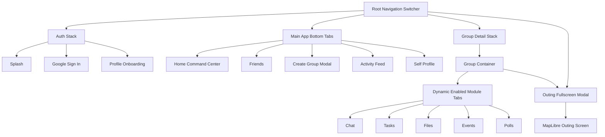

# Purpose-Driven Temporary Social Platform: Master UI & Design System Plan

## 1. Visual Philosophy & Design Principles

The product aesthetic must feel **intentional, spatial, calm, modern, and expensive** without relying on superficial decoration.

### Core Non-Negotiables:
1. **Zero Emoji Icons**: Emojis are strictly banned as UI iconography or navigation elements.
2. **One Cohesive Vector Icon Language**: Use custom SVG vector icons with uniform 2pt stroke weight, rounded cap/corner joins, and 24pt optical size.
3. **Typography First**: Hierarchy is established through scale, weight, and deliberate whitespace before applying color.
4. **Spatial Calm**: Built strictly on a 4-point base grid and an 8-point layout rhythm. No arbitrary pixel values.
5. **Controlled Depth**: Minimal elevation and subtle blur only when clarifying sheet/modal layering. Zero excessive glassmorphism.
6. **No Cheap Gradients or AI Dashboard Appearance**: Avoid flashy, rainbow gradients or generic cards crammed with meaningless graphs.

---

## 2. Design Tokens Specification

```typescript
export const Tokens = {
  // Spacing (4pt base / 8pt rhythm)
  spacing: {
    xs: 4,
    sm: 8,
    md: 16,
    lg: 24,
    xl: 32,
    xxl: 48,
  },

  // Corner Radii
  radius: {
    sm: 8,       // Buttons, tags, badges
    md: 12,      // Cards, text inputs
    lg: 16,      // Sheets, dialogs, media previews
    xl: 24,      // Main modal containers, floating rails
    full: 9999,  // Avatars, pill tags
  },

  // Color Palette (Curated HSL)
  colors: {
    // Primary: Indigo-Violet
    primary: {
      default: 'hsl(245, 68%, 58%)',
      light: 'hsl(245, 75%, 68%)',
      dark: 'hsl(245, 65%, 45%)',
      subtle: 'hsl(245, 60%, 96%)',
    },
    // Secondary: Deep Teal
    secondary: {
      default: 'hsl(172, 66%, 40%)',
      light: 'hsl(172, 60%, 55%)',
      dark: 'hsl(172, 70%, 30%)',
      subtle: 'hsl(172, 50%, 95%)',
    },
    // Neutral Surfaces & Text
    background: 'hsl(220, 20%, 98%)',
    surface: 'hsl(0, 0%, 100%)',
    surfaceSubtle: 'hsl(220, 14%, 95%)',
    textPrimary: 'hsl(222, 47%, 11%)',    // Deep Blue-Black
    textSecondary: 'hsl(215, 16%, 47%)',  // Slate Muted
    textDisabled: 'hsl(215, 16%, 70%)',
    border: 'hsl(214, 20%, 88%)',
    borderSubtle: 'hsl(214, 20%, 94%)',

    // Status Signals
    status: {
      success: 'hsl(152, 68%, 38%)',
      warning: 'hsl(38, 92%, 50%)',
      danger: 'hsl(354, 70%, 54%)',
      info: 'hsl(204, 88%, 53%)',
    }
  },

  // Typography Scales
  typography: {
    display: { fontSize: 32, lineHeight: 40, fontWeight: '700' },
    title1: { fontSize: 24, lineHeight: 30, fontWeight: '600' },
    title2: { fontSize: 20, lineHeight: 26, fontWeight: '600' },
    title3: { fontSize: 17, lineHeight: 22, fontWeight: '600' },
    body: { fontSize: 15, lineHeight: 20, fontWeight: '400' },
    callout: { fontSize: 14, lineHeight: 18, fontWeight: '500' },
    footnote: { fontSize: 13, lineHeight: 16, fontWeight: '400' },
    caption: { fontSize: 11, lineHeight: 14, fontWeight: '500' },
  },

  // Touch Targets & Controls
  controls: {
    minTouchTarget: 44,
    buttonHeight: 48,
    primaryTouchTarget: 52,
    avatarSm: 36,
    avatarMd: 44,
    avatarLg: 72,
    bottomNavHeight: 76,
  },

  // Motion & Animation Timing
  motion: {
    instant: 150,
    quick: 250,
    natural: 350,
    deliberate: 450,
    easing: {
      standard: [0.2, 0, 0, 1], // Cubic bezier
      decelerate: [0, 0, 0.2, 1],
      accelerate: [0.4, 0, 1, 1],
    }
  }
};
```

---

## 3. Complete Screen Inventory

```
UI Screen Tree
├── 1. Authentication & Onboarding
│   ├── SCREEN_AUTH_SPLASH
│   ├── SCREEN_AUTH_GOOGLE_SIGNIN
│   ├── SCREEN_AUTH_PROFILE_SETUP
│   └── SCREEN_AUTH_USERNAME_CLAIM
│
├── 2. Main Navigation (Bottom Tabs)
│   ├── TAB_HOME (Command Center)
│   │   ├── SCREEN_HOME_COMMAND_CENTER
│   │   ├── SCREEN_HOME_ACTIVE_RAIL
│   │   └── SCREEN_HOME_ATTENTION_STREAM
│   ├── TAB_FRIENDS
│   │   ├── SCREEN_FRIENDS_LIST
│   │   ├── SCREEN_FRIEND_EXACT_SEARCH
│   │   ├── SCREEN_FRIEND_REQUESTS
│   │   └── SCREEN_FRIEND_PROFILE_VIEW
│   ├── TAB_CREATE (Dedicated Modal Flow)
│   │   ├── SCREEN_CREATE_STEP_IDENTITY
│   │   ├── SCREEN_CREATE_STEP_PURPOSE
│   │   ├── SCREEN_CREATE_STEP_DURATION (Signature Dial)
│   │   ├── SCREEN_CREATE_STEP_FRIENDS
│   │   ├── SCREEN_CREATE_STEP_MODULES
│   │   └── SCREEN_CREATE_STEP_REVIEW
│   ├── TAB_ACTIVITY
│   │   └── SCREEN_ACTIVITY_NOTIFICATION_STREAM
│   └── TAB_PROFILE
│       ├── SCREEN_PROFILE_SELF
│       ├── SCREEN_PROFILE_EDIT
│       └── SCREEN_PROFILE_SETTINGS (Privacy, Haptics, Audio, Devices)
│
├── 3. Group Interior & Purpose Modules
│   ├── SCREEN_GROUP_CONTAINER (Top Header + Dynamic Module Bar)
│   ├── SCREEN_GROUP_OVERVIEW (Hero Card, Countdown, Next Action)
│   ├── SCREEN_MODULE_CHAT (Realtime Messages, Replies, Attachments)
│   ├── SCREEN_MODULE_TASKS (Kanban / Filtered List, Assignees)
│   ├── SCREEN_MODULE_FILES (Document Gallery, Upload Sheet)
│   ├── SCREEN_MODULE_EVENTS (Calendar, Milestones, Venue Details)
│   ├── SCREEN_MODULE_POLLS (Active Polls, Vote Buttons, Visual Results)
│   ├── SCREEN_GROUP_SETTINGS (Admin Controls, Membership Roster)
│   └── SCREEN_GROUP_INVITE_FRIENDS (Friend-only picker)
│
├── 4. Outing & Live Coordination
│   ├── SCREEN_OUTING_MAP (MapLibre Vector View, Custom Markers, Route Geometry)
│   ├── SCREEN_OUTING_BOARD (Live Member ETA & Movement Status)
│   └── SCREEN_LOCATION_PERMISSION_MODAL (Contextual Opt-In Education)
│
├── 5. Lifecycle Transitions
│   ├── SCREEN_GROUP_EXPIRING_BANNER
│   ├── SCREEN_GROUP_EXPIRED_VIEW (Read-Only Mode)
│   └── SCREEN_GROUP_ARCHIVE_VIEW (Export / Read)
│
└── 6. Safety & System States
    ├── SCREEN_SAFETY_BLOCK_CONFIRMATION
    ├── SCREEN_SAFETY_REPORT_USER
    ├── SCREEN_SYSTEM_OFFLINE_INDICATOR
    └── SCREEN_SYSTEM_ERROR_FALLBACK
```

---

## 4. Navigation Structure

Using **React Navigation v6 (Native Stack + Bottom Tabs)**:



---

## 5. Signature UI Component: The Circular Duration Selector

The duration selector is a signature tactile experience configuring:
- **Months**: 0 to 12
- **Days**: 0 to 31
- **Hours**: 0 to 24

### Component Interaction Architecture:
1. **Gesture Physics (Reanimated + Gesture Handler)**:
   - User rotates an interactive precision thumb-dial.
   - Snapping points at every discrete step with subtle angular momentum and spring settling (`damping: 20`, `stiffness: 180`).
   - Boundary bounce and slight overshoot feedback when rotating past min/max bounds.
2. **Tactile Haptic Feedback**:
   - Discrete short tick (`Haptics.impactAsync(ImpactFeedbackStyle.Light)`) emitted on crossing every discrete number value.
   - Distinct confirmation buzz (`ImpactFeedbackStyle.Medium`) when thumb releases and snap settles.
3. **Auditory Feedback**:
   - Short synthesized mechanical click on value increments.
   - Settle confirmation tone on gesture release (respects system mute and user profile sound toggle).
4. **Accessibility Stepper Fallback**:
   - Direct increment/decrement buttons (`+` / `-`) and direct keyboard input for screen-reader users.

---

## 6. Purpose-Specific UI Layout Archetypes

The group interior automatically reorganizes its hero elements and primary action based on the group's `purpose`:

| Purpose Archetype | Hero Dominance | Primary Visible Tool | Supporting Modules |
| :--- | :--- | :--- | :--- |
| **Outing** | Destination + Live ETA + Arrived Count | Live Map & Outing Board | Chat, Events, Polls |
| **Project** | Progress Bar + Impending Milestone | Task Board | Chat, Files, Calendar |
| **Hackathon** | Large Remaining Time Countdown | Task Checklist | Chat, Files, Progress |
| **Birthday** | Countdown to Event Moment | Itinerary & Polls | Chat, Photos, Reminders |
| **Trip** | Next Itinerary Item | Daily Schedule | Map, Files, Expenses |
| **Study** | Next Session Time & Topics | Tasks & Milestones | Chat, Files, Polls |
| **Sports** | Next Match Venue & Timing | Roster & Event | Chat, Polls |
| **Custom** | User-configured Hero Metric | Selected Default Module | Selected Enabled Modules |

---

## 7. Universal Screen State Specifications

Every major screen must implement four mandatory states:

### 7.1 Loading States
- Never use generic full-screen spinning wheels.
- Implement **layout-matching skeleton screens** with subtle shimmer gradients adhering to `Tokens.colors.surfaceSubtle`.
- Skeletons preserve the exact optical height of cards and headers to prevent layout jumping upon data arrival.

### 7.2 Empty States
- Must explain **why** the screen is empty and provide a single **high-clarity next action**.
- Example (No Active Groups): "You have no active groups. Create a temporary group for your next outing, project, or event." $\to$ Single prominent button: `[Create Group]`.
- Example (No Tasks): "All tasks are completed. Tap below to create an action item for this milestone." $\to$ `[Add Task]`.

### 7.3 Error States
- Non-blaming, plain-language description of what failed.
- Guaranteed recovery action: `[Retry Request]`.
- Logs technical error traces silently to Sentry without polluting user-facing copy.

### 7.4 Offline States
- When connectivity is severed, display a top subtle system bar: *"Offline. Displaying cached data."*
- Read actions remain available from the local TanStack Query cache.
- Mutation buttons (e.g. *Send Message*, *Add Task*) show an offline badge indicating actions will execute once reconnected.

---

## 8. Accessibility & Responsiveness Mandates

1. **Touch Target Size**: All interactive buttons, tabs, and hit-boxes must be at least **$44\text{pt} \times 44\text{pt}$** (recommended $48\text{pt}$).
2. **Dynamic Type**: All text components must utilize scalable units (`allowFontScaling={true}`) and respect device text scaling up to 200% without clipping.
3. **Contrast Ratios**: All text and critical UI elements must satisfy **WCAG AA** minimum contrast ratio ($4.5:1$ for normal text, $3:1$ for large text).
4. **Screen Reader Support**: Every custom vector icon, dial control, and avatar must define descriptive `accessibilityLabel` and `accessibilityRole`.
5. **Reduced Motion**: Respect `AccessibilityInfo.isReduceMotionEnabled()`; disable circular dial inertia and instant-switch screen transitions when active.
6. **Responsive Layout**: Utilize `react-native-safe-area-context` to guarantee zero overlap with camera cutouts, dynamic islands, or home indicator bars.
