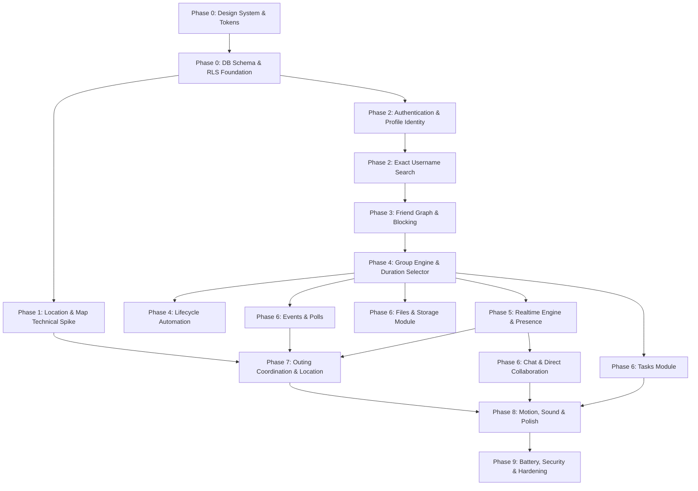

# Purpose-Driven Temporary Social Platform: Master Project Plan

## 1. Executive Summary & Philosophy

This project plan governs the development of the **Purpose-Driven Temporary Social Platform**. The platform is fundamentally structured around a single formula:
$$\text{Purpose} + \text{People} + \text{Tools} + \text{Time} + \text{Realtime} + \text{Lifecycle} = \text{Purpose-Driven Temporary Group}$$

The core architecture follows a **Modular Monolith** built on React Native (Expo development builds with native access) and Supabase (PostgreSQL, Edge Functions, Realtime, Storage, Auth). Infrastructure complexity is deliberately constrained for V1: no premature microservices, Kafka, Redis, or dedicated chat servers.

---

## 2. Dependency Graph & Foundational Ordering

Building features in arbitrary order leads to architectural collapse. Every component must be built strictly according to its operational prerequisites:

### Strict Dependency Principles:
1. **Authentication must precede User Profiles**: Without a verified `auth.users` UUID, profile records cannot exist.
2. **Profiles must precede Exact Username Search**: Normalization triggers and unique constraints must be active.
3. **Exact Search must precede Friendship**: Friends can only be added by entering exact usernames.
4. **Friendships must precede Group Membership**: Server-side enforcement guarantees a user can *only* be invited to a group if an accepted two-way friendship exists with the inviter.
5. **Group Foundation & Server Expiry must precede Modules**: Modules (Chat, Tasks, Events, Location) are child entities scoped to an active group container.
6. **Location Spike must precede Outing Integration**: Native background location, battery drain, and Valhalla routing must be validated on physical devices before embedding into group interiors.
7. **RLS & Server Functions must precede Frontend Logic**: The client UI is never a security boundary.

---

## 3. Comprehensive Development Phases

### Phase 0: Foundation, Architecture & Design Tokens
* **Objective**: Establish the repository, design token contracts, baseline database schema, and automated verification pipeline.
* **Prerequisites**: Repository initialization, Supabase project creation.
* **Deliverables**:
  - React Native (Expo Prebuild / Dev Client) workspace with TypeScript strict mode.
  - Design token library in `src/design/tokens.ts` (4pt base / 8pt grid, radii: 8, 12, 16, 24, typography scales, HSL color palettes: Indigo-Violet primary, Teal secondary, Deep Blue-Black surface/text, Slate muted).
  - Iconography pipeline: Custom SVG / professional vector icons with uniform stroke (2pt) and optical size (24pt). Zero emojis in UI elements.
  - Baseline Supabase migrations with custom UUID generators, `updated_at` trigger functions, and preliminary RLS scaffolding.
  - ESLint, Prettier, Jest, and React Native Testing Library harness.
* **Exit Criteria**: Clean build on iOS and Android simulators; tokens and typography rendered on an internal design-system test screen; Supabase migrations execute cleanly.

---

### Phase 1: Location & Map Technical Spike
* **Objective**: Prove battery efficiency, Valhalla routing, and MapLibre performance on real hardware before building product UI around it.
* **Prerequisites**: Phase 0.
* **Deliverables**:
  - Native location module setup with iOS `UIBackgroundModes = ["location"]` and Android `FOREGROUND_SERVICE_LOCATION`.
  - Movement-detection filter running locally on device (separating raw GPS sampling from network transmission).
  - OpenFreeMap vector tile rendering via `@maplibre/maplibre-react-native`.
  - Integration with Valhalla API for road map matching and multi-point ETA calculation.
  - Standalone spike test harness to measure current draw and battery percentage loss over 30-minute stationary, 30-minute walking, and 60-minute driving intervals.
* **Exit Criteria**: Stationary battery drain $<1\%$ per hour; no unthrottled network GPS flooding; MapLibre runs at 60 FPS on mid-range Android and standard iPhone.

---

### Phase 2: Identity & Exact Username Search
* **Objective**: Enable secure onboarding, profile creation, and exact username discovery without user enumeration vulnerabilities.
* **Prerequisites**: Phase 0.
* **Deliverables**:
  - Supabase Auth integration (Google OAuth + Apple/Email fallbacks).
  - `profiles` table with unique lowercase alphanumeric username constraint (`^[a-z0-9_]{3,20}$`).
  - Automatic profile creation via PostgreSQL trigger on `auth.users` insertion.
  - Avatar image upload pipeline targeting `avatars` bucket with client-side image compression.
  - Exact username search endpoint (via RPC or Edge Function) with rate limiting and constant-time behavior to eliminate prefix enumeration.
  - Profile screen with editable metadata and relationship states.
* **Exit Criteria**: User can sign in, configure profile, upload avatar, and search strictly exact usernames (e.g., `@dhinesh` matches only `@dhinesh`, not `@dhin`).

---

### Phase 3: Social Graph & Friendship Engine
* **Objective**: Build the prerequisite social safety layer ensuring groups are composed solely of mutual friends.
* **Prerequisites**: Phase 2.
* **Deliverables**:
  - `friend_requests` table with statuses: `PENDING`, `ACCEPTED`, `DECLINED`, `CANCELLED`.
  - Canonical `friendships` table storing unordered pairs (`user_low_id < user_high_id`) to prevent duplicate reciprocal records.
  - `blocks` table to isolate users bidirectionally.
  - Realtime subscriptions and push notifications for incoming friend requests and acceptances.
  - UI for Friends rail, incoming/outgoing request manager, and block list.
  - PostgreSQL helper functions: `are_friends(uuid, uuid)` and `is_blocked(uuid, uuid)`.
* **Exit Criteria**: Users can request, accept, decline, cancel friendships, and block peers; database rejects duplicate friendships; helper functions evaluate correctly in RLS.

---

### Phase 4: Group Foundation, Duration Dial & Lifecycle Automation
* **Objective**: Create the core product object: a purpose-driven, time-bound group with server-controlled lifecycle.
* **Prerequisites**: Phase 3.
* **Deliverables**:
  - `groups`, `group_members`, and `group_features` schema.
  - Circular duration selector UI: Months (0–12), Days (0–31), Hours (0–24) with Reanimated gestures, inertia, snap points, mechanical tick haptics, and accessible steppers.
  - Edge Function `create-group` enforcing friend-only invitations, validating duration bounds, and assigning creator as `OWNER`.
  - Server-side lifecycle state machine: `CREATED` $\to$ `ACTIVE` $\to$ `EXPIRING` $\to$ `EXPIRED` $\to$ `ARCHIVED` $\to$ `PURGED`.
  - Background lifecycle worker (Supabase Edge Function scheduled via pg_cron or HTTP webhook) executing every 60 seconds to transition expired groups and revoke write capabilities.
  - Group interior navigation shell displaying enabled purpose-specific module tabs.
* **Exit Criteria**: User creates a group with custom duration; non-friends are rejected by backend during invitation; group expires exactly on server time; client device clock tampering does not bypass expiry.

---

### Phase 5: Realtime Foundation, Messaging & Notifications
* **Objective**: Provide instantaneous communication and situational awareness across active groups.
* **Prerequisites**: Phase 4.
* **Deliverables**:
  - `messages` and `message_attachments` schema with RLS checking active group membership and non-expired lifecycle state.
  - Supabase Realtime channel management with automatic reconnection and offline message queuing.
  - Ephemeral user presence channel (online, offline, viewing module) strictly segregated from physical location.
  - In-app notification center table (`notifications`) and push delivery pipeline (FCM + APNs) via Edge Function `send-notification`.
  - Chat screen with virtualized list (`FlashList`), message replies, attachments, optimistic UI updates, and delivered/read indicators.
* **Exit Criteria**: Messages deliver across devices in $<200\text{ms}$; expired groups reject new message inserts; push notifications fire when user is backgrounded.

---

### Phase 6: Collaboration Modules (Tasks, Files, Events, Polls)
* **Objective**: Implement purpose-driven utilities that activate according to group configuration.
* **Prerequisites**: Phase 5.
* **Deliverables**:
  - **Tasks Module**: `tasks` and `task_assignees` with statuses (Not Started, In Progress, Blocked, Completed) and priorities (Low, Medium, High, Critical). Checkmark draw animation and task reordering.
  - **Files Module**: `files` metadata table and Supabase Storage bucket (`attachments`) with signed download URLs. Supports PDF, images, video, docs.
  - **Events Module**: `events` table driving countdown timers, calendar integrations, and meeting destinations.
  - **Polls Module**: `polls`, `poll_options`, and `poll_votes` with single-vote enforcement and live result updates.
  - Module toggle engine: Group owners/admins can dynamically enable or disable modules in group settings.
* **Exit Criteria**: Each module respects `group_features` activation; RLS forbids interaction with disabled modules; file uploads generate secure signed URLs; poll votes update in realtime.

---

### Phase 7: Outing & Realtime Location Coordination
* **Objective**: Deliver the signature meetup experience with adaptive tracking, Valhalla routing, and automatic arrival termination.
* **Prerequisites**: Phase 1 (Spike) and Phase 6 (Events Module).
* **Deliverables**:
  - `location_sessions` and ephemeral `current_locations` schema.
  - Permission education modal explaining opt-in, group-scoped, temporary tracking.
  - Adaptive native background tracking engine:
    * Stationary: 0 transmissions unless movement $>25\text{m}$.
    * Walking: Transmission every $30\text{s}$ or $15\text{m}$.
    * Driving: Transmission every $10\text{s}$ or $50\text{m}$.
  - Edge Function `location-update` storing current coordinates and broadcasting to active group members.
  - MapLibre outing screen rendering member markers with smooth interpolation, destination marker, and Valhalla road-matched routes.
  - Live Outing Board displaying distance, ETA, movement state (Stationary, Walking, Driving, Arrived).
  - Geofence arrival detection ($50\text{m}$ radius): Automatically marks user as `Arrived` and halts GPS tracking.
  - Automatic tracking termination on group expiration or user manual exit.
* **Exit Criteria**: 5-member live outing coordinates smoothly on map; markers interpolate without jumping; arrivals trigger immediate tracking shutdown; zero coordinate leaks outside group.

---

### Phase 8: Premium Experience, Motion & Polish
* **Objective**: Refine visual, tactile, and auditory feedback to achieve an expensive, calm, cohesive product feel.
* **Prerequisites**: Phases 4–7.
* **Deliverables**:
  - Shared element transitions and spatial layout animations using React Native Reanimated.
  - Dial interaction polish: Inertia dampening, boundary bounce, mechanical sound synthesis, haptic tick integration.
  - Empty, loading (skeleton screens), error, and offline status overlays across every major screen.
  - Dark/Light mode theme alignment adhering strictly to design tokens.
  - Elimination of any residual generic styling, emojis, or ad-hoc margins.
* **Exit Criteria**: 60 FPS maintained during all animated transitions; UI communicates state changes clearly; complete accessibility review passes WCAG AA contrast.

---

### Phase 9: Hardening, Security Audit & Production Verification
* **Objective**: Subject the system to rigorous security, network failure, and battery endurance testing.
* **Prerequisites**: All previous phases.
* **Deliverables**:
  - RLS policy verification test suite executing hundreds of unauthorized access scenarios.
  - Real-device battery benchmark validation: 30m stationary, 30m walking, 60m driving.
  - Simulated network failure testing (airplane mode, 3G throttling, packet loss) validating recovery and cache integrity.
  - Comprehensive Maestro / Detox end-to-end user journeys.
  - Complete data retention and purge worker automation.
* **Exit Criteria**: All tests pass; zero high/critical vulnerabilities; battery consumption validated on physical devices; zero data leakage.

---

## 4. MVP vs. Post-MVP Scope Matrix

| Capability / Feature | MVP Scope (V1) | Post-MVP Scope (V2+) | Rationale |
| :--- | :--- | :--- | :--- |
| **Authentication** | Google OAuth + Supabase Auth | Apple Sign-In, Email magic links, Passkeys | Google covers cross-platform V1 testing needs cleanly. |
| **User Discovery** | Exact username search only (`@username`) | QR code invite links, contacts matching | Prevents enumeration; preserves privacy baseline. |
| **Social Graph** | Two-way mutual friendships, blocking | Circles, mutual friend recommendations | Strict friend-only group prerequisite is core to V1 safety. |
| **Group Purposes** | Outing, Project, Hackathon, Birthday, Custom | Trip, Sports, Study dedicated layouts | Focuses initial engineering on the most demanding archetypes. |
| **Duration Selector**| Circular dial (Months, Days, Hours) | Recurring meeting schedules, auto-renew | V1 is strictly temporary and single-lifecycle. |
| **Lifecycle** | Created $\to$ Active $\to$ Expiring $\to$ Expired | Extended retention tiers, PDF group export | V1 guarantees hard auto-closure and purge. |
| **Chat** | Text, replies, attachments, read state | Audio messages, reactions, message editing | Essential communication without chat-app bloat. |
| **Tasks** | Title, deadline, priority, status, assignees | Subtasks, Kanban drag-and-drop, dependencies | Delivers core project utility without JIRA complexity. |
| **Files** | Documents, images, PDFs up to 50MB | Collaborative rich-text docs, video transcoding | Storage backed by Supabase with signed URLs. |
| **Location & Maps** | MapLibre, OpenFreeMap, Valhalla routing, ETA | Offline map packs, turn-by-turn voice navigation | Outing coordination requires ETA and position, not full nav. |
| **Architecture** | Modular monolith on Supabase + React Native | Dedicated Valhalla cluster, Redis cache | Monolith satisfies V1 scale with minimal ops burden. |

---

## 5. Major Milestones & Definition of Done (DoD)

### Milestone 1: Core Domain & Identity Scaffolding (End of Phase 2)
* **Definition of Done**:
  1. Supabase database schema deployed with all profile, auth, and audit tables.
  2. RLS enabled on 100% of tables; default deny policy verified.
  3. Google OAuth login completes and creates a profile row automatically.
  4. Username is strictly lowercase alphanumeric and guaranteed unique.
  5. Exact username search returns *only* exact matches; sub-string/prefix attacks return empty.
  6. Zero TypeScript warnings; automated schema migration scripts committed.

### Milestone 2: The Social Trust Engine (End of Phase 3)
* **Definition of Done**:
  1. Users can send, accept, decline, and cancel friend requests.
  2. Canonical `friendships` table maintains unordered unique pairs.
  3. Blocked users cannot see or interact with the blocker in search or requests.
  4. Server-side helper `are_friends(a, b)` returns true only for accepted friendships.
  5. Realtime notifications fire upon friend actions.

### Milestone 3: Temporary Group Engine & Lifecycle (End of Phase 4)
* **Definition of Done**:
  1. Circular duration selector smoothly configures months, days, hours with haptic/sound feedback.
  2. Edge Function `create-group` strictly rejects non-friend invitees with HTTP 403.
  3. Group is created with server-verified `starts_at` and `expires_at`.
  4. Lifecycle cron worker transitions groups to `EXPIRED` within 60 seconds of expiration.
  5. Any database insert or update attempted on an expired group is blocked by RLS.

### Milestone 4: Collaboration & Realtime Sync (End of Phase 6)
* **Definition of Done**:
  1. Realtime chat delivers messages between members with $<200\text{ms}$ latency.
  2. Tasks, files, events, and polls function seamlessly within their enabled module tabs.
  3. Modules disabled for a group cannot be accessed or mutated via direct API calls.
  4. File uploads generate secure, time-limited signed URLs.

### Milestone 5: The Outing & Location Experience (End of Phase 7)
* **Definition of Done**:
  1. User grants location permissions via an educational onboarding flow.
  2. Location updates transmit only during an active group location session.
  3. Battery optimization suppresses updates when stationary ($0$ network transmissions).
  4. MapLibre renders OpenFreeMap vector tiles with custom vehicle/pedestrian markers.
  5. Valhalla provides snapped road coordinates and accurate ETA to destination.
  6. Arriving within $50\text{m}$ of destination terminates tracking automatically.
  7. Terminated/expired sessions delete location coordinates immediately.

### Milestone 6: Production Readiness & Release (End of Phase 9)
* **Definition of Done**:
  1. Battery test suite verifies $<1\%$ drain/hour when stationary and $<5\%$ drain/hour while driving.
  2. Zero emojis used anywhere in the UI; uniform custom vector icon library active.
  3. All screens implement purposeful loading skeletons, empty states, error fallbacks, and offline banners.
  4. Penetration/RLS test suite validates that client spoofing cannot read other groups' data or bypass friendship rules.
  5. Physical devices (iOS and Android) pass full end-to-end flow without crashes.

---

## 6. Implementation Progress & Module Status

### Part 7 — Collaborative Modules (COMPLETED)
- **Step 7.1: Collaborative Task Board Engine** (`tasks`, `task_assignees`, drag/drop, Realtime sync, RLS) — **Done**
- **Step 7.2: Instant Polls & Consensus Engine** (`polls`, `poll_options`, `poll_votes`, quorum, live tally, RLS) — **Done**
- **Step 7.3: Itinerary, Events & Countdown Engine** (`events`, live ticker countdown, ICS calendar export, RLS) — **Done**
- **Step 7.4: Media Vault & Attachment Engine** (`public.files`, Supabase storage signed URLs, upload/delete lifecycle, RLS) — **Done**

### Part 8 — Realtime Map, Outing Coordination & Live ETA Engine (IN PROGRESS)
- **Step 8.1: Location Session Architecture & Opt-In Permissions** — **COMPLETED**
  - Schema: Multi-participant outing sessions (`location_sessions`), explicit opt-in roster (`location_session_participants`), and latest active fix only (`current_locations` with composite primary key `(session_id, user_id)`).
  - Strict Privacy Boundary: Location decoupled from User Profile, Presence, and Group Membership (`Group Member ≠ Location Participant`).
  - Automatic Coordinate Purge: Triggers delete coordinates when participant leaves, session concludes, or space auto-dissolves.
  - Two-Stage Consent: Educational modal (`LocationOptInModal`) outlining 4 core guarantees (Session-Scoped, Strict Privacy, Ephemeral Purge, Zero Silent Tracking) before triggering native OS foreground location permission via `expo-location`.
  - Android-First Design: Obsidian Dark screen (`LocationSessionScreen`), countdown badge, active outing card, participating roster, bespoke vector icons (zero emojis), and read-only freeze when group expires.
  - Tests & Build: 4 new test suites (100% pass rate: 46/46 suites, 360/360 tests) + clean Android Metro bundle export.
- **Step 8.2: Adaptive Geolocation & Battery Optimization Engine** — **COMPLETED**
  - Haversine Geodesic Math (`geoUtils.ts`): Accurate physical displacement calculation and strict coordinate/accuracy filters ($\le 65\text{m}$).
  - Movement Classification (`movementEngine.ts`): Realtime state detection (`STATIONARY`, `WALKING`, `DRIVING`, `UNKNOWN`) with cross-validated speed/displacement and multi-sample hysteresis against GPS noise spikes.
  - Adaptive Transmission Policy (`locationTransmissionPolicy.ts`): Strict separation between GPS sampling and network transmission:
    - `STATIONARY`: 0 network transmissions by default; transmits only if displacement $> 25\text{m}$.
    - `WALKING`: Transmits every $30\text{s}$ OR displacement $\ge 15\text{m}$.
    - `DRIVING`: Transmits every $10\text{s}$ OR displacement $\ge 50\text{m}$.
    - `INITIAL_LOCATION`: First fix transmitted immediately to establish baseline position.
    - Duplicate jitter suppression: $< 3\text{m}$ in $< 60\text{s}$ suppressed.
  - Centralized Engine Service (`locationEngine.ts`): Idempotent single active watcher, bounded network retry (1-item latest fix, no historical route queue), monotonic timestamp guards against race conditions, lifecycle integration (`AppState`, `onGroupExpired`, `onAuthSignedOut`).
  - React Lifecycle Hook (`useLocationTracking.ts`): Manages live tracking state synchronized with participant opt-in and space expiration.
  - UI Telemetry Card: Live movement badge with bespoke vector icons (`WalkingIcon`, `CarIcon`, `ActivityPulseIcon`, `BatterySavingIcon`), sync count, and adaptive battery suppression tag.
  - Verification: 5 new test suites (51/51 suites, 403/403 tests passing, 100% pass rate) and clean Android Metro export bundle.
- **Step 8.3: MapLibre Vector Map & Ephemeral Participant Visualization** — **COMPLETED**
  - Vector Map Architecture: Implemented `@maplibre/maplibre-react-native` with keyless OpenFreeMap Dark vector tiles (`https://tiles.openfreemap.org/styles/dark`) adhering to Neram's Obsidian Dark palette.
  - Separation of Concerns: Map is purely a consumer of location state; GPS acquisition, filtering, and transmission remain isolated within Step 8.2 (`locationEngine`).
  - Realtime Synchronization (`useRealtimeLocations`): Subscribes to `public.current_locations` via Supabase Realtime channel `realtime-locations-${sessionId}` with initial fetch + merge, disconnect handling, and automatic teardown on unmount.
  - Smooth Coordinate Interpolation (`interpolateCoordinate`): Linear spherical lerp animation with large-jump snap protection ($> 2000\text{m}$) preventing panning across artificial trajectories or teleports.
  - Staleness Detection (`locationFreshness`): Fixes older than 5 minutes receive subdued/stale styling (`#6B7280`) with relative age labels ("Just now", "2m ago", "Stale").
  - Destination Resolution (`useEventDestination`): Integrates Step 7.3 Events itinerary, prioritizing upcoming milestone events with coordinates, then upcoming events, falling back to location session coordinates.
  - Member Markers (`MemberLocationMarker`): Avatar / 2-letter uppercase initials fallback, movement state ring (Cyan for Driving, Emerald for Walking, Amber for Stationary), self pulse glow ring, and "YOU" badge.
  - Destination Marker (`DestinationMarker`): Rendezvous pin / milestone flag with venue name pill.
  - Map Viewport Controls (`LocationMapControls`): "Center on Me" (moves viewport without re-requesting GPS), "Fit Group" (fits camera bounds over members and destination), and connection status banner.
  - Outing Screen Integration: Vector map prominently embedded in `LocationSessionScreen` during active sessions.
  - Comprehensive Verification: 8 new unit/component test suites (59/59 suites, 446/446 tests passing, 100% pass rate), 0 ESLint warnings, 0 TypeScript errors, and clean Android Metro export bundle (1236 modules compiled in 5.4s).
- **Step 8.4: Valhalla Routing, Live ETA & Destination Geofence Engine** — *Upcoming*

